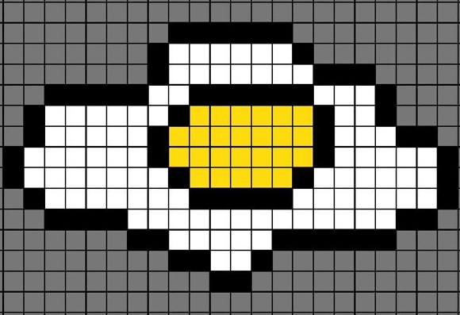
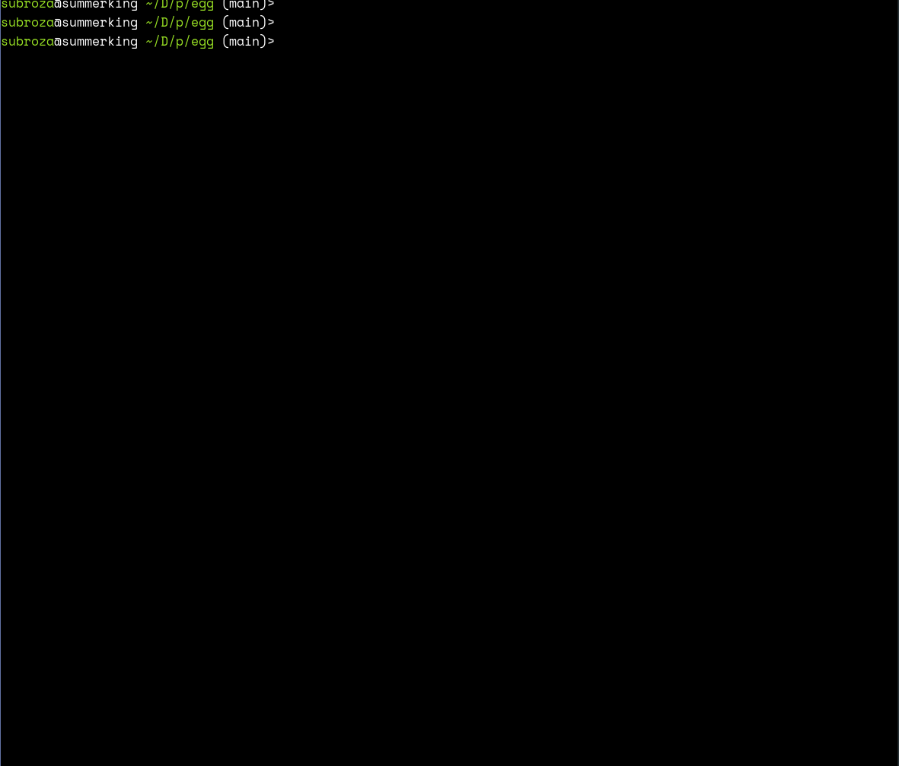

## EGG (Engine for Game & Graphics)

A single-file/header-only library for generating pixel graphics on the console.  
No external libraries like ncurses — uses only cursor escape sequences.

 
**Demo**
 
`$ make demo_maze_gen`  

`$ make demo_moving_circle`  

`$ make demo_game_of_life`  

